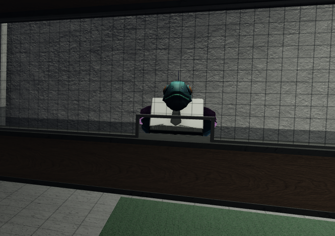
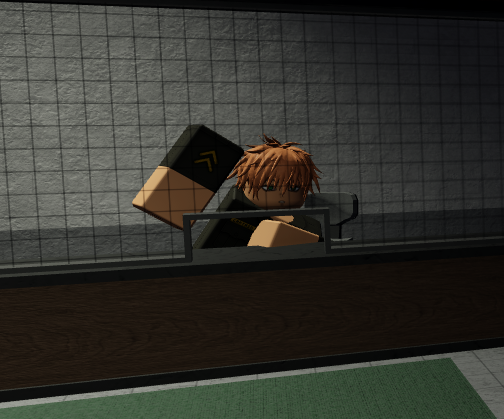

# NPCs

Non-Player Characters (NPCs) in Prison RP - Project Hexa.

## NPC List

| NPC Name  | Location                      | Description     |
|-----------|-------------------------------|-----------------|
| Duckarro  | Wardens building (Entrance)   | Face editor     |
| Capt. Mustapha | Wardens building (Entrance) | RP name & height modifier |
| Shop NPC | Cell block exit (right side) | Opens skin crate shop |

## Duckarro

Duckarro is a duck NPC located at the entrance of the Warden's building. He serves as the Face editor, allowing players to customize their character's appearance.

### Pricing

- **First face change**: Free
- **Each subsequent change**: 75 Robux

## Capt. Mustapha

Capt. Mustapha is an NPC located next to Duckarro at the entrance of the Warden's building. He allows players to change their RP name and in-game height.

### Modifications

- **RP Name**: Change your character's RP name
- **In-game Height**: Adjust your character's height (scale: 1-0.8)

## Shop NPC

Shop NPC is located at the cell block exit (right side) and opens the skin crate shop, allowing players to purchase cosmetic items.

---

*Last Updated: [Date]*
